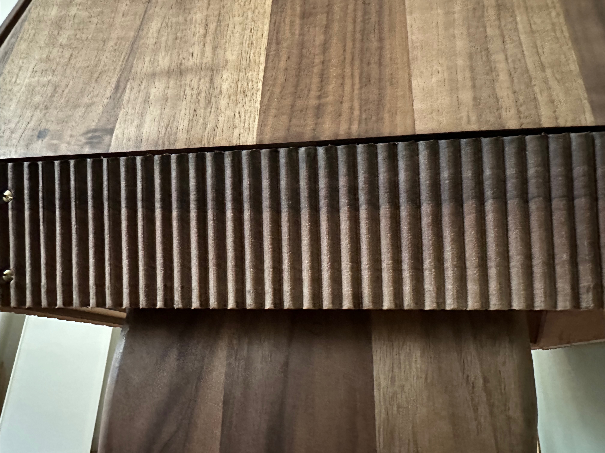

# Bar Robot

Once I saw the [photo of this amazing design of Borghesani](https://www.1stdibs.com/furniture/storage-case-pieces/dry-bars/spectacular-mobile-bar-designed-borghesani/id-f_1240042/#zoomModalOpen) on the web I decided to build my own.

I measured it out from the photos and created a model in Fusion360, and got some american walnut:

